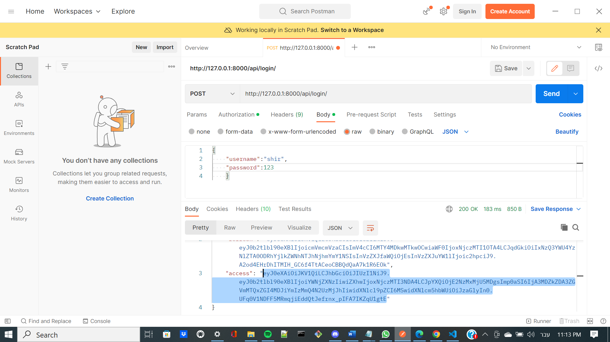
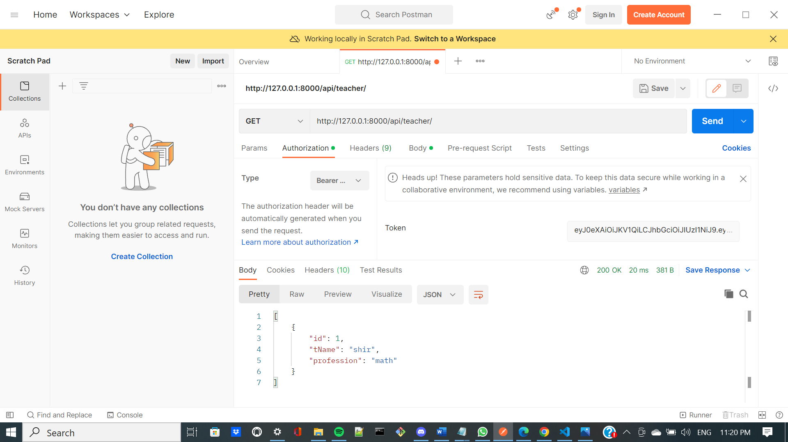

# django rest api full crud + authentication template

## **school management**

- using the following technologies: python, django, sqlite3

### **project locator:**
https://github.com/shirepsh/django_full_crud_authentication_template
1. enter into GitHub & serach my profil as - shirepsh
2. in my repositorie looking for - "django_full_crud_authentication_template"
3. open the terminal in your Workspace 

### **guide line:**
- If you have not installed Python3, please do
- Please make sure you have 'pip' installed on your OS. 
If it is not installed, please refer to the link below and follow the steps: [Link to PyPa.io](https://pip.pypa.io/en/stable/cli/pip_install/)

1. download the project from GitHub by the comment:
```bash
git clone
```
2. install virtualenv
```bash 
pip install virtualenv
```
3. open venv named venv
```bash
python -m virtualenv venv
```
4. get into the venv 
```bash
venv\Scripts\active
```
5. install all the right packages with the requirements file
```bash
pip install -r requirements.txt  
``` 
6. run the application by the comment:
```
py manage.py runserver
```
7. in order to get to the data you will need user, open the terminal and create a user to yourself
```
py manage.py createsuperuser
```
8. add your name, email and password

9. run the application again by the comment:
```
py manage.py runserver
```
10. once the code is active copy the url that created ("http://127.0.0.1:8000") to postMan

11. on postMan enter thr url and add the endpoint "http://127.0.0.1:8000/api/login"
change to POST and on body write your username & password like this
```
{
    "username":"",
    "password:""
}
```
12. once you logged in you will get 2 tokens,
copy the access token (without the "")



13. change the url to "http://127.0.0.1:8000/api/teacher"

14. change from body to Authorization field , choose Bearer token and past the token


15. now you can use all the crud and get your data!

## you can also open the test.html and connect & get data in the browser (after you create user at the terminal) ###
 in order to do this you will need to install at the vscode extensions "open in default browser" and open the html file due to this one. 
